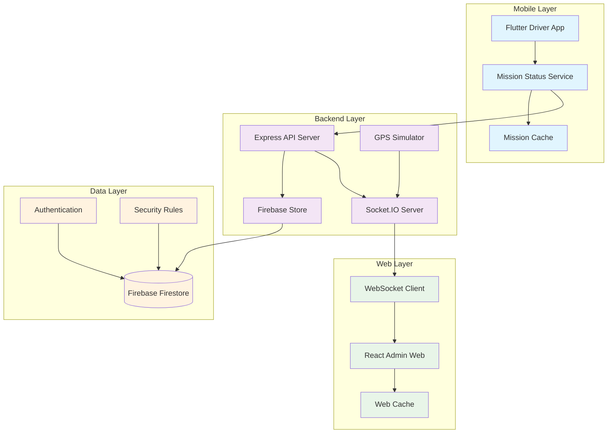
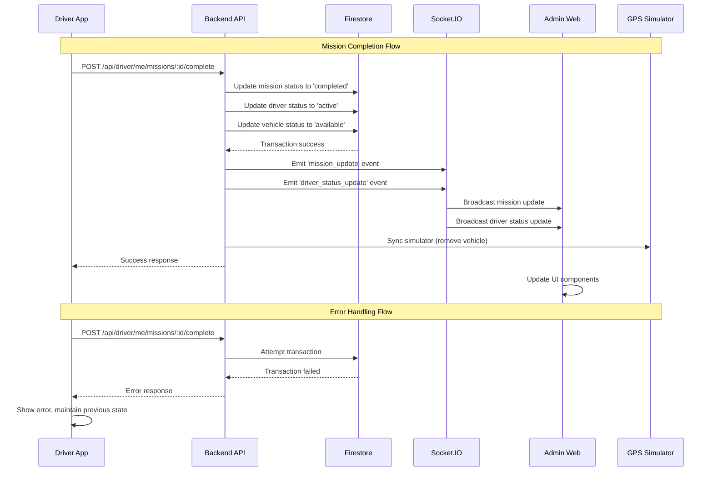

# Design Document - Synchronisation Temps Réel des Missions

## Overview

This design document outlines the technical implementation for real-time mission status synchronization between the Flutter driver mobile application and React admin web platform. The system leverages Firebase Firestore as the single source of truth and Socket.IO for real-time communication, ensuring instant propagation of mission status changes across all connected clients.

The architecture builds upon the existing Node.js backend infrastructure, extending current Firebase operations and Socket.IO capabilities to support comprehensive real-time synchronization with robust error handling, offline support, and performance optimization.

### Key Design Principles

- **Single Source of Truth**: Firestore serves as the authoritative data store for all mission states
- **Event-Driven Architecture**: Status changes trigger cascading updates through Socket.IO events
- **Graceful Degradation**: System maintains functionality during network interruptions
- **Optimistic Updates**: UI responds immediately while background synchronization ensures consistency
- **Security First**: All operations validated through authentication and authorization layers

## Architecture

### System Components



### Data Flow Architecture



## Components and Interfaces

### Mobile Application Components

#### MissionStatusService
**Purpose**: Manages mission status updates and synchronization with backend
**Location**: `driver_mobile/lib/services/mission_status_service.dart`

```dart
class MissionStatusService {
  // Core mission operations
  Future<Mission> completeMission(String missionId, {
    double? distance,
    double? fuelConsumed,
    String? notes
  });
  
  Future<Mission> cancelMission(String missionId, String reason);
  
  // Real-time synchronization
  Stream<Mission> watchMissionUpdates(String missionId);
  Future<void> syncPendingUpdates();
  
  // Offline support
  Future<void> queueOfflineUpdate(MissionUpdate update);
  Future<List<MissionUpdate>> getPendingUpdates();
}
```

#### MissionCache
**Purpose**: Local storage for mission data and offline queue management
**Location**: `driver_mobile/lib/services/mission_cache.dart`

```dart
class MissionCache {
  Future<void> cacheMission(Mission mission);
  Future<Mission?> getCachedMission(String missionId);
  Future<void> queueUpdate(MissionUpdate update);
  Future<List<MissionUpdate>> getQueuedUpdates();
  Future<void> clearQueue();
}
```

### Backend API Extensions

#### Mission Status Controller
**Purpose**: Handles mission status update requests with validation and transaction management
**Location**: `backend/controllers/missionStatusController.js`

```javascript
class MissionStatusController {
  async completeMission(req, res) {
    // Validate request and user authorization
    // Execute Firestore transaction
    // Emit Socket.IO events
    // Update GPS simulator
    // Return response
  }
  
  async cancelMission(req, res) {
    // Similar flow for mission cancellation
  }
  
  async getMissionStatus(req, res) {
    // Real-time status retrieval
  }
}
```

#### Real-time Event Manager
**Purpose**: Manages Socket.IO event emission and client targeting
**Location**: `backend/services/realtimeEventManager.js`

```javascript
class RealtimeEventManager {
  emitMissionUpdate(mission, targetClients = 'all');
  emitDriverStatusUpdate(driverId, status, targetClients = 'all');
  emitVehicleStatusUpdate(vehicleId, status, targetClients = 'all');
  
  // Client management
  registerClient(socketId, clientType, userId);
  unregisterClient(socketId);
  getTargetedClients(eventType, data);
}
```

### Web Application Components

#### Real-time Mission Manager
**Purpose**: Handles incoming Socket.IO events and updates React state
**Location**: `web/src/services/realtimeMissionManager.js`

```javascript
class RealtimeMissionManager {
  constructor(socketClient, stateManager) {
    this.socket = socketClient;
    this.stateManager = stateManager;
    this.setupEventListeners();
  }
  
  setupEventListeners() {
    this.socket.on('mission_update', this.handleMissionUpdate.bind(this));
    this.socket.on('driver_status_update', this.handleDriverStatusUpdate.bind(this));
  }
  
  handleMissionUpdate(mission) {
    // Update mission in state
    // Trigger UI animations
    // Update dashboard metrics
  }
}
```

#### Dashboard Auto-refresh Service
**Purpose**: Manages periodic updates for mission lists, maps, and metrics
**Location**: `web/src/services/dashboardRefreshService.js`

```javascript
class DashboardRefreshService {
  startAutoRefresh(components = ['missions', 'map', 'metrics']) {
    // Set up timers for each component
    // Handle refresh intervals
    // Manage component lifecycle
  }
  
  refreshMissionsList();
  refreshLiveMap();
  refreshDashboardMetrics();
}
```

## Data Models

### Enhanced Mission Model

```javascript
// Firestore Collection: missions
{
  id: string,                    // Auto-generated document ID
  driverId: string,             // Reference to driver document
  vehicleId: string,            // Reference to vehicle document
  destination: string,          // Mission destination
  purpose: string,              // Mission purpose/description
  startTime: timestamp,         // Mission start time
  endTime?: timestamp,          // Mission completion time
  status: MissionStatus,        // Current mission status
  startLocation: string,        // Starting location
  endLocation?: string,         // Ending location (for completed missions)
  distance?: number,            // Total distance traveled
  fuelConsumed?: number,        // Fuel consumed during mission
  notes?: string,               // Additional notes
  
  // Real-time sync metadata
  lastUpdated: timestamp,       // Last update timestamp
  updatedBy: string,           // User ID who made the update
  syncVersion: number,         // Version for conflict resolution
  
  // Audit trail
  statusHistory: [{
    status: MissionStatus,
    timestamp: timestamp,
    updatedBy: string,
    reason?: string
  }],
  
  createdAt: timestamp,
  updatedAt: timestamp
}
```

### Mission Status Enumeration

```javascript
enum MissionStatus {
  PENDING = 'pending',           // Mission created, not started
  ASSIGNED = 'assigned',         // Mission assigned to driver
  IN_PROGRESS = 'in_progress',   // Mission currently active
  COMPLETED = 'completed',       // Mission successfully completed
  CANCELLED = 'cancelled'        // Mission cancelled
}
```

### Driver Status Model

```javascript
// Enhanced driver document
{
  id: string,
  userId: string,
  status: DriverStatus,
  currentVehicleId?: string,
  currentMissionId?: string,    // New field for active mission tracking
  
  // Real-time tracking
  lastActivity: timestamp,
  isOnline: boolean,
  
  // Existing fields...
  licenseNumber: string,
  licenseExpiry: timestamp,
  rating: number,
  totalMissions: number,
  createdAt: timestamp,
  updatedAt: timestamp
}
```

### Driver Status Enumeration

```javascript
enum DriverStatus {
  ACTIVE = 'active',           // Available for missions
  ON_MISSION = 'on_mission',   // Currently on a mission
  OFF = 'off'                  // Off duty
}
```

### Real-time Event Models

```javascript
// Socket.IO Event: mission_update
{
  type: 'mission_update',
  data: {
    mission: Mission,           // Complete mission object
    previousStatus?: string,    // Previous status for comparison
    timestamp: timestamp
  }
}

// Socket.IO Event: driver_status_update
{
  type: 'driver_status_update',
  data: {
    driverId: string,
    status: DriverStatus,
    previousStatus?: string,
    vehicleId?: string,
    timestamp: timestamp
  }
}

// Socket.IO Event: vehicle_status_update
{
  type: 'vehicle_status_update',
  data: {
    vehicleId: string,
    status: VehicleStatus,
    currentDriverId?: string,
    timestamp: timestamp
  }
}
```

## Error Handling

### Error Classification and Response Strategies

#### Network Connectivity Errors
**Scenario**: Mobile app loses internet connection during mission update
**Strategy**: 
- Queue updates locally using SQLite/SharedPreferences
- Display offline indicator in UI
- Retry with exponential backoff when connection restored
- Validate data integrity before sync

```dart
class NetworkErrorHandler {
  Future<void> handleOfflineUpdate(MissionUpdate update) async {
    await _missionCache.queueUpdate(update);
    _showOfflineIndicator();
    _scheduleRetry();
  }
  
  Future<void> retryQueuedUpdates() async {
    final updates = await _missionCache.getQueuedUpdates();
    for (final update in updates) {
      try {
        await _missionService.syncUpdate(update);
        await _missionCache.removeFromQueue(update.id);
      } catch (e) {
        // Exponential backoff for failed retries
        _scheduleRetry(delay: _calculateBackoffDelay());
      }
    }
  }
}
```

#### Firestore Transaction Failures
**Scenario**: Concurrent mission updates cause transaction conflicts
**Strategy**:
- Implement optimistic locking with version numbers
- Retry transactions with fresh data
- Fallback to eventual consistency for non-critical updates

```javascript
async function updateMissionWithRetry(missionId, updates, maxRetries = 3) {
  for (let attempt = 1; attempt <= maxRetries; attempt++) {
    try {
      return await db.runTransaction(async (transaction) => {
        const missionRef = db.collection('missions').doc(missionId);
        const missionDoc = await transaction.get(missionRef);
        
        if (!missionDoc.exists) {
          throw new Error('Mission not found');
        }
        
        const currentData = missionDoc.data();
        const expectedVersion = updates.expectedVersion || currentData.syncVersion;
        
        if (currentData.syncVersion !== expectedVersion) {
          throw new Error('Version conflict - mission was updated by another client');
        }
        
        const newData = {
          ...updates,
          syncVersion: currentData.syncVersion + 1,
          updatedAt: admin.firestore.FieldValue.serverTimestamp()
        };
        
        transaction.update(missionRef, newData);
        return { ...currentData, ...newData };
      });
    } catch (error) {
      if (attempt === maxRetries) throw error;
      
      // Exponential backoff
      await new Promise(resolve => 
        setTimeout(resolve, Math.pow(2, attempt) * 1000)
      );
    }
  }
}
```

#### Socket.IO Connection Failures
**Scenario**: Web client loses Socket.IO connection
**Strategy**:
- Automatic reconnection with exponential backoff
- Fallback to HTTP polling for critical updates
- State reconciliation after reconnection

```javascript
class SocketConnectionManager {
  constructor(socket) {
    this.socket = socket;
    this.reconnectAttempts = 0;
    this.maxReconnectAttempts = 5;
    this.setupEventHandlers();
  }
  
  setupEventHandlers() {
    this.socket.on('disconnect', this.handleDisconnect.bind(this));
    this.socket.on('connect', this.handleReconnect.bind(this));
    this.socket.on('connect_error', this.handleConnectionError.bind(this));
  }
  
  handleDisconnect() {
    this.showConnectionStatus('disconnected');
    this.startReconnectionAttempts();
  }
  
  async handleReconnect() {
    this.reconnectAttempts = 0;
    this.showConnectionStatus('connected');
    
    // Reconcile state after reconnection
    await this.reconcileState();
  }
  
  async reconcileState() {
    // Fetch latest data to ensure consistency
    const latestMissions = await this.fetchLatestMissions();
    this.updateLocalState(latestMissions);
  }
}
```

### Error Recovery Mechanisms

#### Data Consistency Recovery
**Purpose**: Resolve state inconsistencies between clients
**Implementation**:

```javascript
class ConsistencyManager {
  async detectInconsistencies() {
    const localState = await this.getLocalState();
    const serverState = await this.getServerState();
    
    return this.compareStates(localState, serverState);
  }
  
  async resolveInconsistencies(inconsistencies) {
    for (const inconsistency of inconsistencies) {
      switch (inconsistency.type) {
        case 'mission_status_mismatch':
          await this.resolveMissionStatusConflict(inconsistency);
          break;
        case 'driver_status_mismatch':
          await this.resolveDriverStatusConflict(inconsistency);
          break;
      }
    }
  }
  
  async resolveMissionStatusConflict(conflict) {
    // Server state takes precedence
    const serverMission = await this.fetchMissionFromServer(conflict.missionId);
    await this.updateLocalMission(serverMission);
    this.notifyUI('mission_updated', serverMission);
  }
}
```

## Testing Strategy

### Unit Testing Approach

**Framework**: Jest for backend, Flutter Test for mobile, React Testing Library for web

**Coverage Requirements**:
- Mission status update logic: 100%
- Error handling paths: 95%
- Real-time event emission: 90%
- Data validation: 100%

**Key Test Categories**:

1. **Mission Status Transitions**
   - Valid status changes (in_progress → completed, in_progress → cancelled)
   - Invalid status changes (completed → in_progress)
   - Concurrent update handling

2. **Real-time Event Propagation**
   - Event emission to correct clients
   - Event payload validation
   - Client filtering logic

3. **Error Recovery**
   - Network failure scenarios
   - Transaction conflict resolution
   - Data consistency validation

### Integration Testing

**Test Environment**: Firebase Emulator Suite + Test Socket.IO server

**Critical Integration Scenarios**:

1. **End-to-End Mission Completion**
   ```javascript
   describe('Mission Completion Flow', () => {
     it('should complete mission and notify all clients', async () => {
       // Setup: Create active mission
       const mission = await createTestMission();
       const webClient = await connectWebClient();
       
       // Action: Complete mission via mobile API
       const response = await completeMissionAPI(mission.id);
       
       // Assertions
       expect(response.status).toBe(200);
       expect(response.data.mission.status).toBe('completed');
       
       // Verify real-time notification
       const webNotification = await waitForSocketEvent(webClient, 'mission_update');
       expect(webNotification.data.mission.status).toBe('completed');
       
       // Verify database state
       const dbMission = await getMissionFromDB(mission.id);
       expect(dbMission.status).toBe('completed');
     });
   });
   ```

2. **Offline Synchronization**
   ```javascript
   describe('Offline Sync', () => {
     it('should sync queued updates when connection restored', async () => {
       // Setup: Simulate offline state
       await simulateOfflineState();
       
       // Action: Attempt mission update while offline
       await completeMissionOffline(missionId);
       
       // Verify: Update queued locally
       const queuedUpdates = await getQueuedUpdates();
       expect(queuedUpdates).toHaveLength(1);
       
       // Action: Restore connection
       await restoreConnection();
       
       // Verify: Updates synced to server
       await waitForSync();
       const serverMission = await getMissionFromServer(missionId);
       expect(serverMission.status).toBe('completed');
     });
   });
   ```

### Performance Testing

**Load Testing Scenarios**:
- 100 concurrent mission updates
- 500 connected Socket.IO clients
- 1000 GPS position updates per minute

**Performance Benchmarks**:
- Mission update response time: < 200ms
- Socket.IO event propagation: < 50ms
- Database transaction completion: < 100ms

**Monitoring and Alerting**:
- Firebase Firestore read/write metrics
- Socket.IO connection count and latency
- API response time percentiles
- Error rate thresholds

### Security Testing

**Authentication Testing**:
- Token validation for all mission operations
- Authorization checks for mission ownership
- Rate limiting for API endpoints

**Data Validation Testing**:
- Input sanitization for mission updates
- SQL injection prevention (though using NoSQL)
- XSS prevention for web interface

**Firestore Security Rules Testing**:
```javascript
// Test security rules
describe('Firestore Security Rules', () => {
  it('should allow drivers to update only their own missions', async () => {
    const driverAuth = testEnv.authenticatedContext('driver1');
    const otherDriverAuth = testEnv.authenticatedContext('driver2');
    
    // Should succeed
    await assertSucceeds(
      driverAuth.firestore()
        .collection('missions')
        .doc('mission1')
        .update({ status: 'completed' })
    );
    
    // Should fail
    await assertFails(
      otherDriverAuth.firestore()
        .collection('missions')
        .doc('mission1')
        .update({ status: 'completed' })
    );
  });
});
```

## Correctness Properties

*A property is a characteristic or behavior that should hold true across all valid executions of a system-essentially, a formal statement about what the system should do. Properties serve as the bridge between human-readable specifications and machine-verifiable correctness guarantees.*

### Property Reflection

After analyzing all acceptance criteria, several properties can be consolidated to eliminate redundancy:

- Properties 1.3 and 4.3 both test driver status updates after mission completion - these can be combined
- Properties 2.1 and 2.2 both test Socket.IO event emission - these can be combined into a comprehensive event emission property
- Properties 6.1, 6.2, and 6.5 all relate to offline/online state management - these can be combined
- Properties 8.1 and 8.2 both test audit trail recording - these can be combined

### Property 1: Mission Status Update Consistency

*For any* active mission and any valid termination action (complete or cancel), the mission status in Firestore SHALL be updated to the corresponding final state (completed or cancelled) and the driver status SHALL be updated to "active".

**Validates: Requirements 1.1, 1.2, 1.3, 4.3**

### Property 2: Real-time Event Propagation

*For any* mission or driver status update in Firestore, the Socket.IO server SHALL emit the corresponding event ("mission_update" or "driver_status_update") with complete data payload to all connected clients.

**Validates: Requirements 2.1, 2.2, 2.3, 2.4**

### Property 3: Error Handling and State Preservation

*For any* failed update operation, the system SHALL display an appropriate error message, maintain the previous state, and offer recovery options where applicable.

**Validates: Requirements 1.4, 5.3, 6.3**

### Property 4: UI Responsiveness During Operations

*For any* update operation initiated by a user, the interface SHALL immediately display loading indicators and disable action buttons until the operation completes.

**Validates: Requirements 1.5, 5.1**

### Property 5: Vehicle Resource Management

*For any* mission that transitions to "completed" or "cancelled" status, the associated vehicle SHALL be automatically freed and made available for new assignments.

**Validates: Requirements 4.2**

### Property 6: Concurrent Update Protection

*For any* set of concurrent mission updates, the system SHALL use Firestore transactions to ensure data consistency and prevent race conditions.

**Validates: Requirements 4.4**

### Property 7: Network State Management

*For any* network connectivity change (offline/online), the mobile application SHALL display appropriate status indicators, queue updates when offline, and automatically synchronize when connectivity is restored.

**Validates: Requirements 6.1, 6.2, 6.5**

### Property 8: Socket.IO Connection Resilience

*For any* Socket.IO disconnection event, the web client SHALL attempt automatic reconnection and the server SHALL continue operating with graceful degradation.

**Validates: Requirements 6.4**

### Property 9: Event Targeting Efficiency

*For any* real-time event emission, the Socket.IO server SHALL deliver events only to clients that are affected by or interested in the specific update.

**Validates: Requirements 7.1**

### Property 10: Data Caching Optimization

*For any* data access pattern, the mobile application SHALL utilize local caching to minimize network requests while maintaining data freshness.

**Validates: Requirements 7.4**

### Property 11: Transaction Batching

*For any* set of related updates occurring within a short time window, the system SHALL batch them into single Firestore transactions to optimize performance.

**Validates: Requirements 7.5**

### Property 12: Audit Trail Completeness

*For any* mission status change, the system SHALL record a complete audit trail including timestamp, user ID, and change details in Firestore.

**Validates: Requirements 8.1, 8.2, 8.3**

### Property 13: Event Logging

*For any* real-time event emission, the Socket.IO server SHALL log the event with timestamp and metadata for monitoring and debugging purposes.

**Validates: Requirements 8.4**

### Property 14: Authorization Enforcement

*For any* mission update request, the system SHALL verify that only the assigned driver or authorized personnel can modify the mission status.

**Validates: Requirements 9.1, 9.3, 9.4**

### Property 15: GPS Integration Preservation

*For any* mission status change, the GPS tracking system SHALL be updated accordingly (start/stop tracking) while preserving all existing GPS functionality.

**Validates: Requirements 10.1, 10.2, 10.3, 10.4**

## Error Handling

### Error Categories and Recovery Strategies

#### 1. Network Connectivity Errors
**Symptoms**: Connection timeouts, DNS resolution failures, network unreachable
**Recovery Strategy**:
- Implement exponential backoff retry mechanism
- Queue operations locally for offline execution
- Display clear offline/online status indicators
- Automatic synchronization upon connectivity restoration

#### 2. Authentication and Authorization Errors
**Symptoms**: Invalid tokens, expired sessions, insufficient permissions
**Recovery Strategy**:
- Automatic token refresh when possible
- Graceful session expiration handling
- Clear error messages for permission issues
- Secure logout and re-authentication flow

#### 3. Database Transaction Conflicts
**Symptoms**: Firestore transaction failures, version conflicts, concurrent modifications
**Recovery Strategy**:
- Optimistic locking with version numbers
- Automatic retry with fresh data
- Conflict resolution using server state as authority
- User notification for unresolvable conflicts

#### 4. Socket.IO Communication Failures
**Symptoms**: Connection drops, event delivery failures, server unavailability
**Recovery Strategy**:
- Automatic reconnection with exponential backoff
- Fallback to HTTP polling for critical updates
- State reconciliation after reconnection
- Graceful degradation to non-real-time mode

#### 5. GPS Integration Errors
**Symptoms**: Simulator sync failures, position update errors, tracking inconsistencies
**Recovery Strategy**:
- Isolated error handling to prevent mission system impact
- Automatic GPS system resynchronization
- Fallback to manual position updates
- Comprehensive logging for debugging

### Error Monitoring and Alerting

#### Application Performance Monitoring (APM)
- Real-time error tracking with stack traces
- Performance metrics for API endpoints
- User session replay for debugging
- Custom alerts for critical error thresholds

#### Logging Strategy
```javascript
// Structured logging format
{
  timestamp: "2025-01-15T10:30:00.000Z",
  level: "error",
  service: "mission-sync",
  operation: "completeMission",
  userId: "driver123",
  missionId: "mission456",
  error: {
    type: "FirestoreTransactionError",
    message: "Transaction failed due to concurrent modification",
    code: "ABORTED",
    retryable: true
  },
  context: {
    attemptNumber: 2,
    maxRetries: 3,
    clientType: "mobile"
  }
}
```

## Testing Strategy

### Dual Testing Approach

The testing strategy combines unit tests for specific scenarios with property-based tests for universal behaviors, ensuring comprehensive coverage of the real-time synchronization system.

**Unit Tests**: Focus on specific examples, edge cases, and integration points
**Property Tests**: Verify universal properties across all valid inputs using randomized testing

### Property-Based Testing Configuration

**Framework**: fast-check for JavaScript/Node.js backend, flutter_test with property testing extensions for Flutter mobile app

**Test Configuration**:
- Minimum 100 iterations per property test
- Each property test references its design document property
- Tag format: **Feature: mission-realtime-sync, Property {number}: {property_text}**

### Unit Testing Focus Areas

1. **Specific Mission Status Transitions**
   - Valid transitions: pending → in_progress → completed
   - Invalid transitions: completed → in_progress
   - Edge cases: rapid successive updates

2. **Socket.IO Event Handling**
   - Event payload validation
   - Client connection management
   - Reconnection scenarios

3. **Firebase Integration Points**
   - Authentication token handling
   - Firestore security rules validation
   - Transaction retry mechanisms

4. **UI State Management**
   - Loading state transitions
   - Error message display
   - Offline indicator behavior

### Integration Testing Scenarios

1. **End-to-End Mission Lifecycle**
   - Mission creation → assignment → completion → cleanup
   - Real-time updates across all clients
   - GPS system synchronization

2. **Network Resilience Testing**
   - Offline operation and queue management
   - Reconnection and synchronization
   - Partial connectivity scenarios

3. **Concurrent User Testing**
   - Multiple drivers updating missions simultaneously
   - Admin dashboard updates during high activity
   - Database consistency under load

### Performance Testing Requirements

**Load Testing Targets**:
- 200 concurrent mission updates per minute
- 1000 connected Socket.IO clients
- 5000 GPS position updates per minute
- 50 simultaneous admin dashboard users

**Performance Benchmarks**:
- Mission update API response: < 200ms (95th percentile)
- Socket.IO event propagation: < 50ms
- Firestore transaction completion: < 100ms
- Mobile app UI response: < 100ms

**Monitoring Metrics**:
- API endpoint response times and error rates
- Socket.IO connection count and message throughput
- Firestore read/write operations and costs
- Mobile app crash rates and performance metrics

### Security Testing

**Authentication Testing**:
- Token validation and expiration handling
- Session management across app restarts
- Multi-device login scenarios

**Authorization Testing**:
- Mission ownership validation
- Admin privilege verification
- Cross-tenant data isolation

**Data Protection Testing**:
- Input sanitization and validation
- Firestore security rules enforcement
- Audit trail integrity

### Test Environment Setup

**Development Environment**:
- Firebase Emulator Suite for Firestore and Authentication
- Local Socket.IO server with test configuration
- Mock GPS simulator for predictable testing

**Staging Environment**:
- Firebase project with test data
- Production-like Socket.IO configuration
- Real GPS simulation with controlled scenarios

**Production Monitoring**:
- Real-time error tracking and alerting
- Performance monitoring and profiling
- User experience analytics and feedback

### Continuous Integration Pipeline

```yaml
# CI/CD Pipeline Configuration
stages:
  - unit_tests:
      - backend_unit_tests
      - mobile_unit_tests
      - web_unit_tests
  
  - property_tests:
      - backend_property_tests
      - mobile_property_tests
      - integration_property_tests
  
  - integration_tests:
      - end_to_end_scenarios
      - network_resilience_tests
      - concurrent_user_tests
  
  - performance_tests:
      - load_testing
      - stress_testing
      - endurance_testing
  
  - security_tests:
      - authentication_tests
      - authorization_tests
      - data_protection_tests
```

### Test Data Management

**Test Data Strategy**:
- Synthetic data generation for property tests
- Controlled test scenarios for integration tests
- Production data anonymization for performance testing

**Data Cleanup**:
- Automatic test data cleanup after test runs
- Isolated test environments to prevent data pollution
- Backup and restore mechanisms for test databases

This comprehensive testing strategy ensures the real-time mission synchronization system is robust, performant, and secure across all supported platforms and usage scenarios.